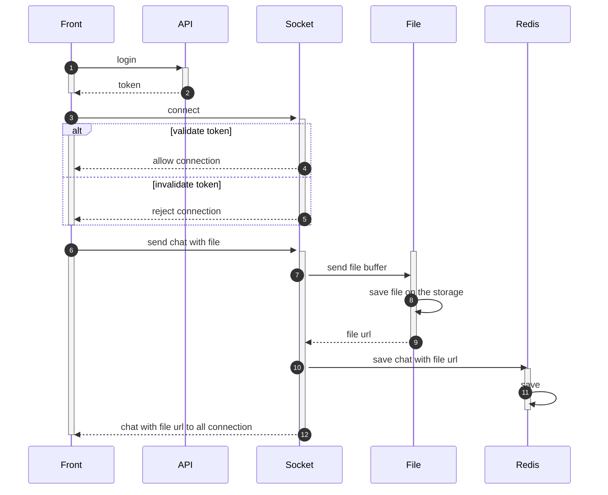
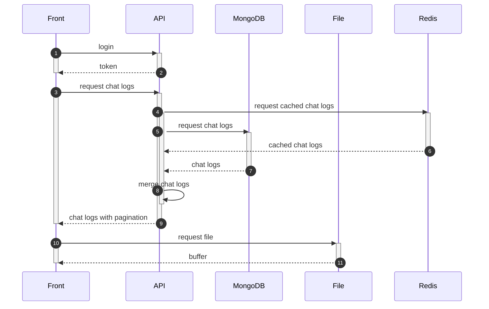

## Description

This project is chatting service that is server side with a socket.

This project has a monorepo architecture, and the applications are architecture as bellow.

## Apps

- api 
- file
- socket
- worker

## Features

- User registration and login function
- Security communication feature utilizing JWT token
- Connecting and disconnecting sockets
- Chatting room management function
- Text and file relay and storage function
- A feature that makes cache with a chat log
- A feature that save a chat log that has cached with out concurrency problem
- A feature that delete expired file and old chat log every specific time
- A function that save chat logs as batch
- Some test codes including unit and e2e

## System architecture


## Sequence diagram

### 1. Send chat



### 2. Load chat



## Before to run

You need to update .env.local file to run this project.

Please follow the comment on the that file.

## Installation

```bash
$ yarn install
```

## Running the app

```bash
# development
$ yarn run start

# watch mode
$ yarn run start:dev

# production mode
$ yarn run start:prod
```

## Test

```bash
# unit tests
$ yarn run test
```

## Docker
```bash
# you can use docker-compose.yml for this
$ docker compose up -d
```