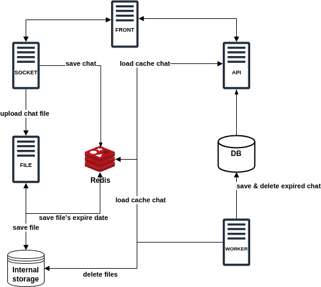
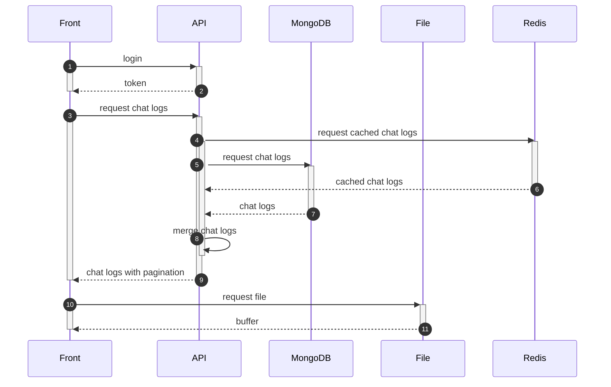

## Description


This project is a high-performance chat system that uses a Redis cache server to efficiently manage and store large volumes of chat logs in real-time.

Instead of saving chat logs directly to the database in real-time, Redis is used to cache the logs, which reduces system load. The chat logs stored in the cache are periodically saved to the database, allowing for efficient handling of large-scale chat data.

This approach is designed to maintain real-time responsiveness while minimizing the burden of data storage, enabling the system to reliably support simultaneous chats with a large number of users.

## Apps

- **API**: Handles the role of providing users with chat room lists and chat logs. This server processes data based on client requests and provides the necessary information.

- **File**: Responsible for receiving data in buffer format and saving it with specific file extensions. This server processes various file formats and ensures they are stored reliably for user access.

- **Socket**: Manages real-time data exchange with clients through socket connections.

- **Worker**: A server that processes a series of tasks executed at regular intervals. This server performs repetitive necessary tasks in the background to maintain the system's ongoing stability and performance.

## Features

**User Registration and Login**: Implemented a robust registration and login system for user authentication, ensuring secure management and access of user data.

**Secure Communication with JWT Tokens**: Utilized JWT (JSON Web Token) tokens for user authentication and session management, enhancing data security during communication.

**Chat Room Management**: Provided functionality for creating and managing various chat rooms, supporting smooth interactions between users. Includes permission management and user control within chat rooms.

**Text and File Storage**: Stored text messages and files exchanged by users on the server to maintain data consistency and integrity.

**Chat Log Caching**: Used Redis to cache real-time chat logs, reducing the load on the database and enabling quick data access.

**Concurrent Data Storage for Cache**: Implemented mechanisms to reliably store cached chat logs into the database, avoiding concurrency issues and maintaining data integrity.

**Automatic Cleanup of Expired Files and Old Chat Logs**: Automatically cleaned up expired files and old chat logs at regular intervals to maintain system performance and prevent unnecessary resource waste.

**Batch Saving of Chat Logs**: Provided functionality to batch save cached chat logs to the database at scheduled intervals, efficiently handling and managing large-scale data.

**Test Code**: Wrote some test codes including unit tests and end-to-end (e2e) tests to verify system stability and reliability, and to enhance maintainability.

## System architecture


## Sequence diagram

### 1. Send chat


### 2. Load chat



## Before to run

You need to update .env.local file to run this project.

Please follow the comment on the that file.

## Installation

```bash
$ yarn install
```

## Running the app

```bash
# development
$ yarn run start

# watch mode
$ yarn run start:dev

# production mode
$ yarn run start:prod
```

## Test

```bash
# unit tests
$ yarn run test
```

## Docker
```bash
# you can use docker-compose.yml for this
$ docker compose up -d
```