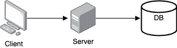
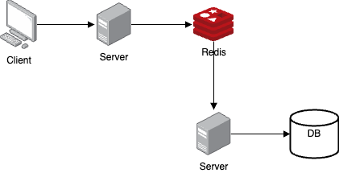
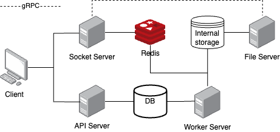
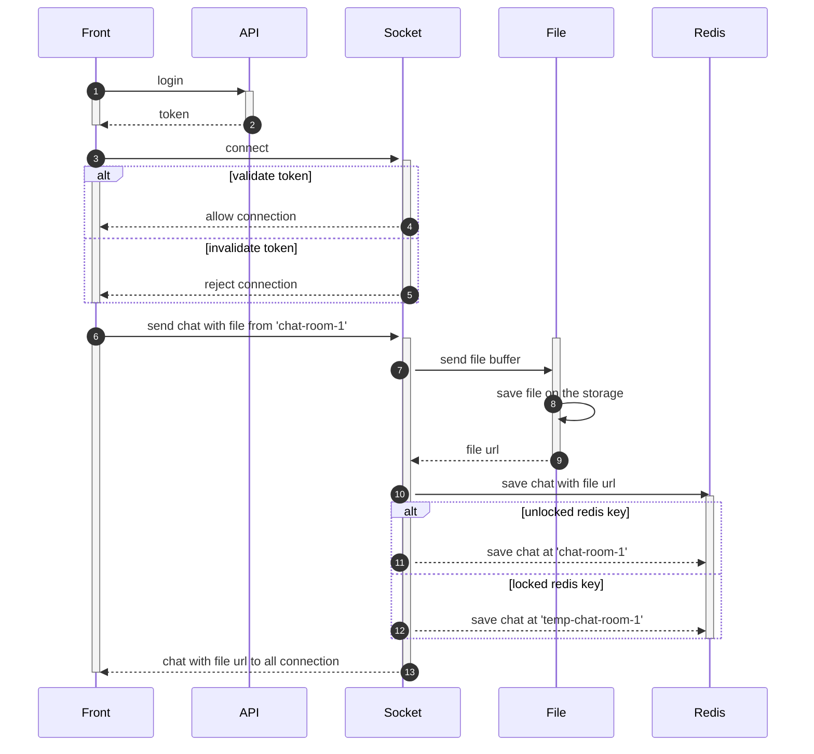
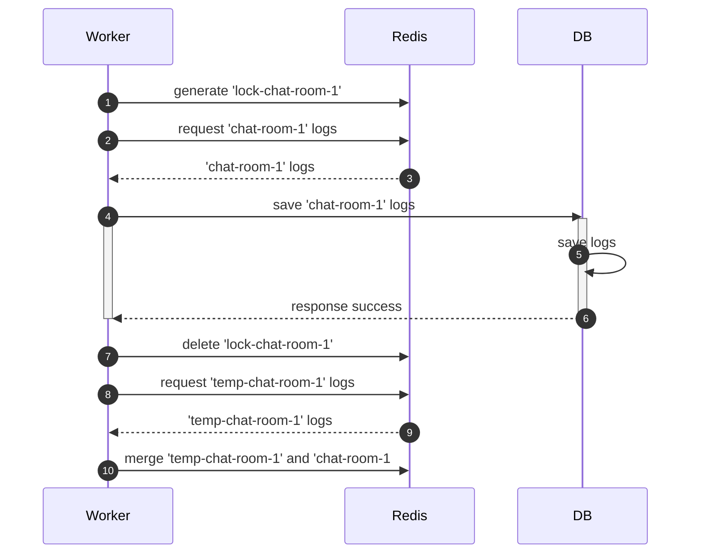
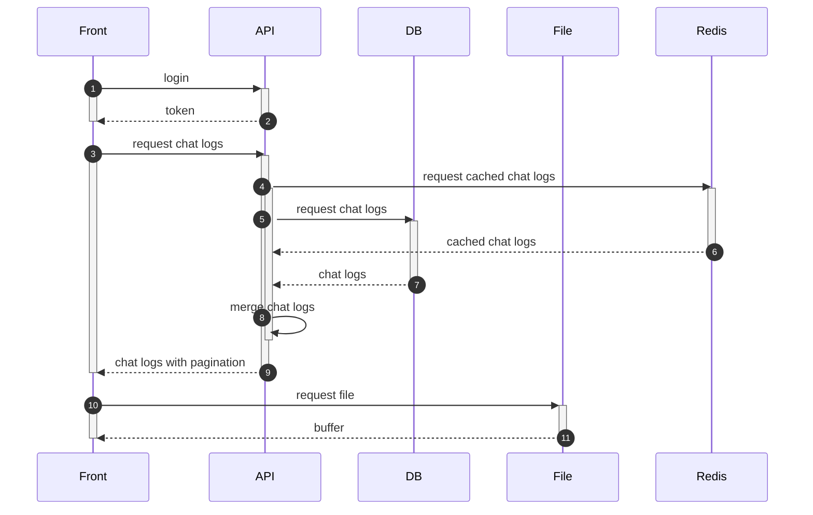

# 고성능 채팅 서비스

### 개요

---

이 프로젝트는 실시간으로 다수의 채팅 로그를 효율적으로 관리하고 데이터베이스에 저장하기 위해 Redis 캐시 서버를 활용한 고성능 채팅 시스템입니다.
실시간 채팅 로그를 즉시 데이터베이스에 저장하는 대신, Redis를 사용하여 로그를 캐시화하고, 이를 통해 시스템 부하를 줄였습니다. 캐시에 저장된 채팅 로그는 일정 시간마다 일괄적으로 데이터베이스에 저장되며, 이를 통해 대규모 채팅 데이터를 효율적으로 처리할 수 있습니다. 이 방식은 실시간 응답성을 유지하면서도 데이터 저장에 대한 부담을 최소화하여, 더 많은 사용자와의 동시 채팅을 안정적으로 지원할 수 있도록 설계되었습니다.

### 구조 개선

---

A. DB 단일 구조



B. 캐시서버 활용 구조



**구조 비교표**

| **항목** | A. DB 단일 구조 | B. 캐시서버 활용 구조 |
| --- | --- | --- |
| **DB 부하** | 클라이언트 요청마다 DB에 직접 저장으로 높은 부하 발생 | 캐시 서버를 통해 DB 호출 빈도 감소로 부하 경감 |
| **응답 속도** | DB 작업에 따라 응답 지연 가능성 있음 | 캐시 서버를 활용해 빠른 응답 제공 |
| **성능** | 실시간 요청 증가 시 병목 현상 발생 가능 | 캐시 서버로 병목 현상 방지 |
| **대량 데이터 처리** | 대량 요청 처리 시 DB에 과부하 발생 | 캐시 서버가 대량 데이터 처리에 효과적  |

**성능 테스트**

시나리오: 사용자가 접속하여 채팅을 연속으로 10번을 보낸 후, 연결 종료 이 작업을 10초간 반복한다.

| 항목 | A. DB 단일 구조 | B. 캐시서버 활용 구조 |
| --- | --- | --- |
| 총 가상 사용자 수 | 10명 | 10명 |
| 완료된 사용자 수 | 10명 | 10명 |
| 실패한 사용자 수 | 0명 | 0명 |
| 총 `emit` 이벤트 수 | 100개 | 100개 |
| `emit` 이벤트 속도 | 평균 13 이벤트/초 | 평균 11 이벤트/초 |
| 세션 길이(평균) | 18.1초 | 14.9초 |
| 세션 길이(최소-최대) | 11.8초 - 52.5초 | 10.7초 - 32.2초 |

### 시스템 구성

---



시스템 구성도

**API Server:** 사용자에게 채팅방 목록과 채팅 로그를 제공하는 역할을 수행합니다.

**Socket Server:** 클라이언트와의 Socket 연결을 통해 실시간 데이터를 주고받는 기능을 담당합니다.

**File Server:** gRPC통신으로 Buffer 형식의 데이터를 받아 특정 파일 확장자로 저장하는 기능을 담당합니다.

**Worker Server:** 일정 주기마다 캐시된 채팅 데이터를 DB에 저장 하거나 기간 만료된 파일 또는 채팅 데이터를 제거하는 기능을 수행합니다.

### **사용 기술**

---

**Back-End**

- Nest.js(Express), Socket.io, gRPC

**Database**

- MongoDB

**Cache & Message Broker**

- Redis

**Project Management**

- MonoRepo, MSA

**Test Tool**

- Artillery

**Open API**

- Swagger

### 주요 기능

---

**사용자 등록 및 로그인**

사용자 인증을 위한 강력한 등록 및 로그인 시스템을 구현하여, 사용자 데이터의 안전한 관리와 접근을 보장합니다.

**JWT 토큰을 이용한 
보안 통신**

사용자 인증과 세션 관리를 위해 JWT(Json Web Token) 토큰을 활용하여, 통신 과정에서의 데이터 보안을 강화했습니다.

**채팅방 관리**

다양한 채팅방을 생성하고 관리할 수 있는 기능을 제공하여, 사용자 간의 원활한 상호작용을 지원합니다. 채팅방 내에서의 권한 관리와 사용자 제어 기능도 포함되어 있습니다.

**텍스트 및 파일 저장**

사용자가 주고받는 텍스트 메시지와 파일을 서버에 저장하여 데이터의 일관성과 무결성을 유지합니다.

**채팅 로그 캐싱**

Redis를 이용해 실시간 채팅 로그를 캐시화하여, 데이터베이스에 대한 부하를 줄이고, 빠른 데이터 접근을 가능하게 합니다.

**동시성 문제 해결을 통한 캐시 데이터 저장**

동시성 이슈를 피하고 데이터 무결성을 유지하기 위해, 캐시된 대화 로그를 안정적으로 데이터베이스에 저장하는 메커니즘을 구현했습니다.

**만료된 파일 및 오래된 채팅 로그 삭제**

특정 시간마다 만료된 파일과 오래된 채팅 로그를 자동으로 정리하여, 시스템의 성능을 유지하고 불필요한 리소스 낭비를 방지합니다.

**채팅 로그 일괄 저장**

일정 시간 동안 캐시된 채팅 로그를 일괄적으로 데이터베이스에 저장함으로써, 대규모 데이터를 효율적으로 처리하고 관리할 수 있는 기능을 제공했습니다.

**테스트 코드**

단위 테스트 및 e2e(End-to-End) 테스트를 포함한 일부 테스트 코드를 작성하여, 시스템의 안정성과 신뢰성을 검증하고 유지보수성을 높였습니다.

### 주요 순서도

---






## Before to run

You need to update .env.local file to run this project.

Please follow the comment on the that file.

## Installation

```bash
$ yarn install
```

## Running the app

```bash
# development
$ yarn run start

# watch mode
$ yarn run start:dev

# production mode
$ yarn run start:prod
```

## Test

```bash
# unit tests
$ yarn run test
```

## Docker
```bash
# you can use docker-compose.yml for this
$ docker compose up -d
```