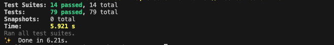

# 고성능 채팅 시스템

### 개요

---

본 프로젝트는 대규모 실시간 채팅 로그를 효율적으로 관리하고 안정적인 데이터 저장을 보장하기 위해 Redis 기반의 캐싱 전략과 배치 처리 방식을 결합한 고성능 채팅 서버 시스템입니다.

일반적인 실시간 채팅 시스템에서 발생하는 데이터베이스 부하 문제를 해결하기 위해, 개별 메시지를 즉시 저장하는 방식이 아닌 캐시서버를 활용한 캐싱 메커니즘을 도입하였습니다. 채팅 로그는 먼저 캐시 서버에 저장 되며, 일정 주기가 도래하면 Worker 서버의 스케줄러가 배치 방식으로 데이터베이스에 일괄 저장하는 구조를 채택하였습니다. 이를 통해 데이터베이스 I/O 부하를 최소화하고, 서버 성능을 최적화하였습니다.

### 구조 개선

---

DB 단일 구조

캐시서버 활용 구조

**비교표**

| **항목** | DB 단일 구조 | 캐시서버 활용 구조 |
| --- | --- | --- |
| **DB 부하** | 클라이언트 요청 마다 DB에 직접 저장으로 높은 부하 발생 | 캐시 서버를 통해 DB 호출 빈도 감소로 부하 경감 |
| **응답 속도** | DB 작업에 따라 응답 지연 가능성 있음 | 캐시 서버를 활용해 빠른 응답 제공 |
| **성능** | 실시간 요청 증가 시 병목 현상 발생 가능 | 캐시 서버로 병목 현상 방지 |
| **대량 데이터 처리** | 대량 요청 처리 시 DB에 과부하 발생 | 캐시 서버가 대량 데이터 처리에 효과적  |

### **성능 테스트**

---

<aside>
💡

테스트는 총 10초 동안 진행되며, 처음에는 초당 10명의 가상 사용자가 생성됩니다. 이후 점진적으로 증가하여 최대 초당 200명의 사용자가 접속하게 됩니다. 각 사용자는 chat 이벤트를 300번 반복해서 전송하며, 이론 상 한 명의 사용자가 총 300여개 까지 채팅 메시지를 서버로 보냅니다.

</aside>

**가상 사용자 생성 및 완료율**

| **항목** | **DB 단일 구조** | **캐시서버 활용 구조** | **변화** |
| --- | --- | --- | --- |
| 총 생성된 vusers | 1050 | 1050 | 동일 |
| 실패한 vusers | 0 | 0 | 동일 |
| 완료된 vusers | 1050 | 1050 | 동일 |
| 성공률 (%) | 100% | 100% | 동일 |

**Socket.io 이벤트 처리**

| **항목** | **DB 단일 구조** | **캐시서버 활용 구조** | **변화** |
| --- | --- | --- | --- |
| 총 이벤트 발생 | 315,000 | 315,000 | 동일 |
| 이벤트 발생률 | 44,255 events/sec | **34,083 events/sec** | **감소 (-10,172 events/sec)** |
| 최대 응답 시간 | 3.1ms | **1.4ms** | **감소 (-1.7ms)** |
| 평균 응답 시간 | 0ms | 0ms | 동일 |
| 99.9% 응답 시간 | 0.1ms | 0ms | 감소 (-0.1ms) |

**세션 지속 시간**

| **항목** | **DB 단일 구조** | **캐시서버 활용 구조** | **변화** |
| --- | --- | --- | --- |
| 평균 세션 지속 시간 | 17.5초 | **6.9초** | **감소 (-10.6초)** |
| 최대 세션 지속 시간 | 331.9초 | **40.1초** | **감소 (-291.8초)** |
| 중앙값 (p50) | 12.8초 | **6초** | **감소 (-6.8초)** |
| 99.9% 지속 시간 | 314.2초 | **23.8초** | **감소 (-290.4초)** |

### 시스템 구성

---

시스템 구성도

| 서버 | 설명 |
| --- | --- |
| **API** | 사용자에게 채팅방 목록과 채팅 로그를 제공하는 역할을 수행합니다. |
| **Socket** | 클라이언트와의 Socket 연결을 통해 실시간 데이터를 주고받는 기능을 담당합니다. |
| **File** | gRPC통신으로 Buffer 형식의 데이터를 받아 특정 파일 확장자로 저장하는 기능을 담당합니다. |
| **Worker** | 일정 주기마다 캐시된 채팅 데이터를 DB에 저장 하거나 기간 만료된 파일 또는 채팅 데이터를 제거하는 기능을 수행합니다. |

### **사용 기술**

---

| **Back-End** | Nest.js(Express), Socket.io, gRPC |
| --- | --- |
| **Cache-Memory** | Redis |
| **Database** | MongoDB |
| **Project Management** | MonoRepo, MSA |
| **Test Tool** | Artillery |
| **Open API** | Swagger |

### 주요 개발 기능

---

📌 **메시지 저장 최적화**

- Redis를 활용한 채팅 메시지 배치 저장(write-back cache strategy) 적용
- 실시간 메시지를 Redis에 임시 저장 후, 일정 주기로 Worker 서버에서 일괄 저장
- Redis XStream을 활용하여 채팅 로그를 스트림 단위로 처리하고, 워커 프로세스를 통해 일정 주기마다 일괄적으로 데이터베이스에 저장하는 메커니즘을 구현하여, 동시성 문제를 방지하고 데이터 무결성을 유지할 수 있도록 설계

📌  **Socket 연결 및 통신 보안 적용**

- 연결 요청 시 JWT(JSON Web Token) 기반 인증 절차 적용
- 비인가 사용자 연결 차단을 통해 불법 접근 및 악의적인 트래픽 방지
- 토큰 만료 및 갱신 로직 적용, 장기 연결 유지 시 보안 취약점 최소화

📌 **텍스트 및 파일 저장**

- 클라이언트로 부터 버퍼(Buffer) 형태로 수신 한 후 특정 파일 형식(이미지, 문서, 오디오 등)으로 변환하는 파일 가공 로직 개발

📌 **MSA 기반 서버 아키텍처**

- Socket 서버와 File 서버 간 RPC(gRPC) 기반 통신 인터페이스 설계 및 개발
    - 실시간 데이터 처리를 위한 Socket 서버와 파일 저장을 담당하는 File 서버 간의 독립적인 서비스 구조

📌 **만료된 파일 및 채팅 로그 삭제**

- 스케줄러를 통한 만료된 자료 삭제 기능

📌 **테스트 코드**

- 주요 기능에 대한 테스트 코드 작성

### 테스트 코드 실행 결과

---

기능 별 테스트 중 일부

테스트 결과

### 주요 순서도

---

채팅 전송 및 캐싱

채팅 일괄 저장

채팅 불러오기